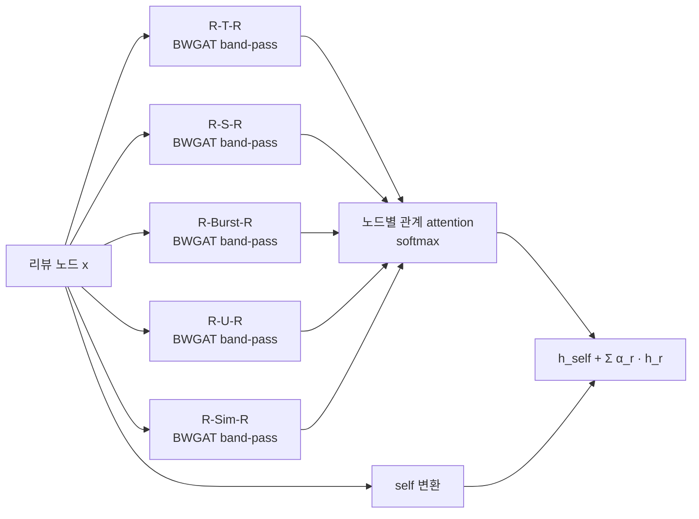

# ITDA GNN 리뷰 어뷰징 탐지 — DRAGWave · [팀] 먹스타

> ITDA 학술대회 본선 **3위** · 2026.05
> 코드: [`source/`](source) (submodule) · 원본 저장소 [39byte/fake_review](https://github.com/39byte/fake_review)
> 대시보드: [Streamlit](https://itda-gnn-dashboard-dbpfa9uth9hdkmnqyjh4cm.streamlit.app)

## 한눈에 보기

| 항목 | 값 |
|---|---|
| 과제 | YelpZip 리뷰 그래프에서 스팸(어뷰징) 리뷰 노드 분류 |
| 데이터 | YelpZip 밀도 중심 샘플 30K 리뷰 · 스팸 13.2% · 시간순 80/20 분할 |
| 그래프 | 리뷰 노드(SBERT 384d + 별점 + 시각 = 386d), 관계 5종: R-T-R · R-S-R · R-Burst-R · R-U-R · R-Sim-R |
| 최종 성능 | Transductive PR-AUC **0.9419** / Macro-F1 **0.9386** (3-way 앙상블) · Inductive PR-AUC **0.7748** (4-way 앙상블) |
| 역할 | 팀원이 구축한 전체 파이프라인(샘플링 → 피처 → 그래프 → 베이스라인)에 **DRAGWave 모델 추가 적용** |

## 내 기여 — DRAGWave

### 문제
기존 최고 모델인 HeteroBWGNN은 관계 5종의 출력을 **같은 가중치로 합산**하고, 각 관계 안에서도 이웃을 **단순 평균**으로 집계했습니다.
그런데 XAI 분석에서 관계마다 기여도 차이가 컸습니다(R-U-R 약 20%, R-S-R 약 0.2%).

### 설계
두 선행 연구의 아이디어를 한 레이어로 결합했습니다.

- **DRAG** (Dynamic Relation-Attentive GNN, ICDMW 2023): 관계별로 따로 임베딩을 만들고, 노드마다 다른 attention으로 관계를 가중합
- **BWGAT** (Beta Wavelet + GAT): 이웃 평균(low-pass) 대신 GAT attention 가중 평균을 쓰고, "자신 − 이웃"(high-pass)으로 이웃과 다른 사기 노드의 신호를 살림

레이어 2개를 쌓고 두 레이어 출력을 concat해 분류합니다. 손실은 클래스 불균형에 맞춰 Focal Loss(γ=2, α=0.75)를 사용했습니다.

### 결과

| 모델 | 그래프 | Transductive PR-AUC | Macro-F1 |
|---|---|---|---|
| HeteroBWGNN (boost, 기존 최고) | 5종 관계 | 0.8969 | 0.8918 |
| **DRAGWave (400 epoch)** | 5종 관계 | **0.9340** | **0.9331** |
| DRAGWave_NoRSR | R-S-R 제거 | 0.9359 | — |
| 3-way 앙상블 (DRAGWave 계열 2 + BWGNN) | | **0.9419** | **0.9386** |

- 단일 모델 기준 기존 최고 대비 **PR-AUC +3.7%p**
- 향상이 epoch 수 때문인지 가리기 위해 HeteroBWGNN · BWGAT를 같은 400 epoch로 학습하는 공정 비교 실험이 있습니다 ([`20_fair_comparison.py`](source/code/src/20_fair_comparison.py)).
- 최종 제출의 두 앙상블(Transductive 3-way, Inductive 4-way) 모두 DRAGWave 계열 모델이 주축입니다. 학습 그래프와 분리된 테스트 서브그래프에서 잰 Inductive 성능도 DRAGWave_TVF(0.7429)와 DRAGWave_NoRSR(0.7234)이 단일 모델 중 가장 높았습니다(BWGNN 0.6526).

관련 코드: [`15_drag_bwgat.py`](source/code/src/15_drag_bwgat.py)

## 한계와 남은 과제
- DRAGWave 학습 PR-AUC 0.9999 대 테스트 0.9340으로 일반화 갭이 남아 있습니다.
- Transductive(0.94)와 Inductive(0.77)의 차이가 커서, 학습 그래프에 없던 신규 리뷰에서는 성능이 떨어집니다.

## 참고
- Kim et al. (2023), *Dynamic Relation-Attentive Graph Neural Networks for Fraud Detection*, ICDMW · arXiv:2310.04171
- Tang et al. (2022), *Rethinking Graph Neural Networks for Anomaly Detection* (BWGNN), ICML
