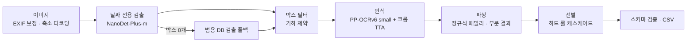

# ITDA OCR Challenge — 소비기한 추출 · [DAT] 캐치캐치

> 제3회 ITDA OCR Challenge 본선 진출작 · 2026.09 – 2026.10
> 코드: [`source/`](source) (submodule) · 원본 저장소 [39byte/itda3-DAT-CatchCatch_Regacy](https://github.com/39byte/itda3-DAT-CatchCatch_Regacy)
> 도메인 활용 웹: [39byte/itda3_DAT_CatchCatch-Web](https://github.com/39byte/itda3_DAT_CatchCatch-Web)

## 한눈에 보기

| 항목 | 값 |
|---|---|
| 과제 | 상품 포장 이미지 1장 → 소비기한 `year, month, day, final_date` |
| 제약 | **CPU 4코어 · GPU 없음 · 네트워크 차단 · 장당 150 ms 이하가 속도 만점** |
| 정확도 | **46.57 / 50** (평가 1,473장) · 튜닝에 쓰지 않은 674장 44.64 / 50 |
| 속도 | 채점 환경 재현 기준 장당 **81 ~ 86 ms** (150 ms 기준 대비 여유 40% 이상) |
| 안정성 | 공식 명령 오프라인 완주 · 형식 오류 0 · 3회 반복 실행 예측 완전 동일 |
| 역할 | <!-- TODO: 팀 구성 / 본인 담당 --> |

## 문제 정의 — "인식"이 아니라 "선별"

- 이미지의 **71%** 에 날짜처럼 생긴 오답(품목보고번호, 바코드, 전화번호, 로트코드)이 있습니다.
- 글자 밀도가 높아(텍스트 20~60줄) 검출된 줄을 전부 읽으면 어떤 모델을 써도 시간 예산을 넘깁니다.

그래서 **값싼 단계에서 후보를 줄이고, 마지막 단계에서 규칙으로 하나를 고르는** 캐스케이드 구조로 설계했습니다.

## 파이프라인

## 핵심 설계 결정

### 1. 범용 텍스트 검출 → 날짜 전용 검출기
| | 검출 recall | recall@1 | 점수 / 50 |
|---|---|---|---|
| RapidOCR 범용 검출 | 82.9% | 26.5% | 36.85 |
| NanoDet 날짜 전용 검출 | 97.6% | 50.2% | 39.71 |
| + 검출기 점수 순서 보존 | 97.6% | **84.7%** | **43.47** |

검출기를 바꾸면 뒤 단계도 함께 바꿔야 했습니다. 기존 기하 기반 재정렬이 검출기의 "날짜다움" 점수를 덮어써
recall@1이 84.7% → 50.2%로 무너지는 것을 찾아내 해당 경로에서 재정렬을 껐습니다.

### 2. 여백을 "고르지" 않고 "표본으로" — 크롭 TTA
끝 글자가 잘리는 임계 여백이 이미지마다 달라, 여백 스윕으로는 개선이 유의하지 않았습니다(p=0.47).
박스마다 여백 2종 크롭을 같은 배치로 읽고 **같은 좌표**를 붙여 기존 병합·순위 규칙이 절단 판독을 떨어뜨리게 했습니다.
→ **+0.83점 (개선 41 / 퇴행 15, 부호검정 p = 6.9e-4)**

### 3. 속도 — 연산을 줄이고 유휴 코어를 채운다
- JPEG `draft()` 축소 디코딩: 4MP 이상 이미지 318 → 103 ms
- 다음 이미지 디코딩을 보조 스레드로 선행(prefetch): **장당 −5.9%**, 예측 차이 0장
- 인식기 출력 헤드 18,710 클래스 중 날짜에 쓰는 77자만 남김(재학습 없음): 인식 약 10% 단축, 예측 차이 0장

### 4. 측정으로 기각한 것도 기록
INT8 양자화, 결측 일자 보정(−0.95), 조건부 2차 판독(−0.23) 등은 A/B에서 손해로 나와 채택하지 않았습니다.

## 도메인 활용 — 의약품 재고 관리 웹

[itda3_DAT_CatchCatch-Web](https://github.com/39byte/itda3_DAT_CatchCatch-Web) · React 18 · TypeScript · Vite · Tailwind

OCR 파이프라인을 약국·병원 의약품 재고 관리에 붙인 시연용 웹입니다. 팀 공동 작업이며, 그중 제가 맡은 부분은 아래와 같습니다.

| 기여 | 내용 |
|---|---|
| **카메라 OCR 유효기한 입력** ([#1](https://github.com/39byte/itda3_DAT_CatchCatch-Web/pull/1)) | 포장에 카메라를 비추면 가이드 박스 영역만 잘라 OCR 서버로 보내고, **최근 3프레임 중 2번** 같은 날짜가 나오면 입력칸을 자동으로 채웁니다. 저장은 사람이 확인한 뒤에 합니다. 카메라를 못 쓰면 사진 선택으로, 서버가 연결되지 않으면 안내 문구로 대체합니다. |
| **사용 우선순위 추천 페이지** ([#1](https://github.com/39byte/itda3_DAT_CatchCatch-Web/pull/1)) | 1년치 불출 기록으로 약품별 소진 속도를 추정해 로트마다 유효기한 안에 다 쓸 수 있는지 계산합니다. 사용 순서(FEFO)와 조치(우선 사용 · 반품 권고 · 교환 요청 · 양도 검토)를 추천합니다. Python 수요 모델(ADI/CV² 분류, TSB 예측, 몬테카를로 폐기 확률)을 **외부 의존성 없이 TypeScript로 옮기고**, 같은 입력에서 Python 결과와 일치하는지 테스트로 확인했습니다. |
| **입고 등록** | 새 로트를 등록하면 추천 결과에 바로 반영됩니다. |
| **OCR 서버 연결 복구** ([#2](https://github.com/39byte/itda3_DAT_CatchCatch-Web/pull/2)) | 파일 업로드 과정에서 설정 파일이 이전 상태로 덮여 OCR 서버에 연결되지 않던 문제를 찾아, 연결에 필요한 설정만 되돌렸습니다(`/ocr` 프록시, 휴대폰 카메라용 HTTPS 개발 모드). |

## 검증 방법
- 실제 채점 환경(Ubuntu 22.04 · Python 3.10 · 4코어 · 네트워크 차단)을 WSL + `unshare` + `taskset` 으로 재현해 공식 명령으로 실행
- 평가셋의 바이트 중복 135쌍을 찾아내 **튜닝에 쓰지 않은 674장** 점수를 따로 보고(과적합 방지)
- 단위 테스트 173개 · GitHub Actions 벤치 게이트

## 배운 점
<!-- TODO: 본인 언어로 2~3줄 -->
- 정확도와 속도가 경쟁하는 과제에서는 기능마다 장당 비용을 함께 재야 한다.
- 모듈 하나를 바꾸면 그 모듈을 전제로 짠 뒤 단계의 가정이 깨진다.

## 참고
Seker & Ahn (2022), *A generalized framework for recognition of expiration dates on product packages*, ESWA 203 — ExpDate 데이터셋(CC BY 4.0)
